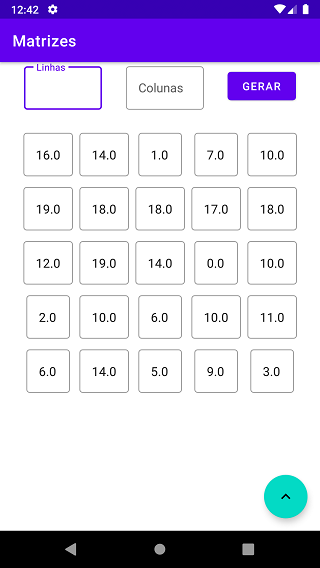
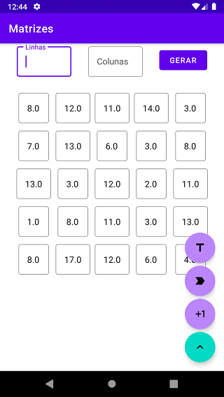

# Matrizes

  

Este é um app para resolução alguns cálculos de matrizes, proposto como 3° nota da matéria de matemática básica do meu curso de ADS. O app em si resolve a 
determinante da matriz (até matrizes de ordem 3), soma, multiplicação (Ambas até o momento somente com duas matrizes) e mostra a matriz transposta. 

## O app

O grande desafio foi como fazer pra a gerar a matriz de acordo com o tamanho que o usuário quisesse, minha primeira ideia foi tentar fazer usando um 
GridLayout programático, tive alguns problemas com as propriedades do layout e então decidi tentar fazer usando RecycleView, biblioteca que eu já estava 
estudando. Comecei criando uma classe Celula que teria como atributo o valor de cada célula, depois criei uma classe MatrizAdapter que iria utilizar o RecycleView 
para criar uma "lista" de células, a lista está entre aspas por motivos que já irei explicar. De relevante no MatrizAdapter: 

```
override fun onCreateViewHolder(parent: ViewGroup, viewType: Int): VH {
        val v = LayoutInflater.from(parent.context).inflate(R.layout.item_matriz, parent, false)

        return VH(v)
    }
```
O ```onCreateViewHolder``` infla o layout contendo um TextInputEditText do material design 3 e passa-o para o ViewHolder. Já na MainActivity na função
```initRecycleView()``` eu defino um GridLayout para a o recycleView passando as colunas digitadas pelo usuario e eu crio a lista 
multiplicando as linhas pelas colunas na função gerarMatriz():

```
private fun gerarMatriz(aleatorio: Boolean) {
        ...

        //Se aleatorio for true gera a matriz já preenchida com valores aleatorios
        if (aleatorio) {
            for (x in 1..colunas * linhas) {
                addCelulaAleatoria()
            }
        } else {
            for (x in 1..colunas * linhas) {
                addCelula()
            }
        }
    }
```

Quando a lista estiver toda preenchida ela ficará com cara de matriz. Depois disso eu somente preciso pegar essa lista, transforma-la definitivamente 
em uma matriz usando a quantidade de colunas, fazer a operação escolhida e transforma-la novamente em lista para ser exibida, caso necessário, e todo 
esse processo eu faço na classe Matriz. 

## Observação 

Eu imagino que tudo isso daria pra ser feito usando uma View personalizada, mas como eu no momento não sabia como fazer e o tempo era curto preferi fazer 
usando o RecycleView mesmo. E em relação a organização do código eu sei que está bem desorganizado kkkkkkkk, mas aproveitei pra fazer da forma que fiz pra depois poder 
organizar tudo usando alguma arquitetura. 
